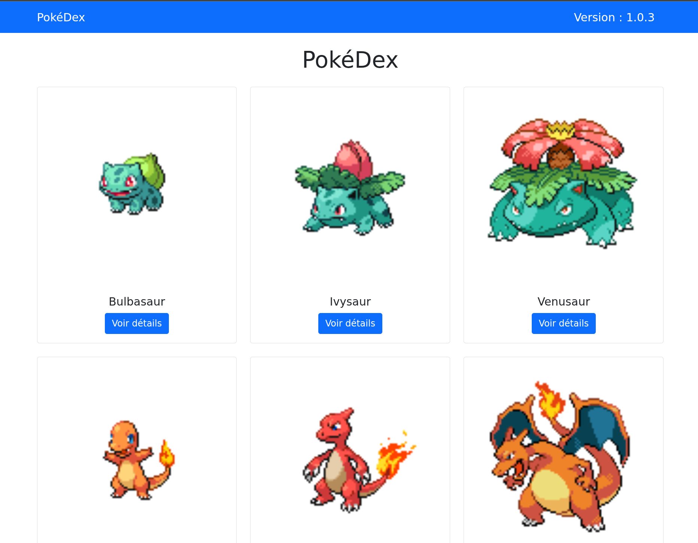
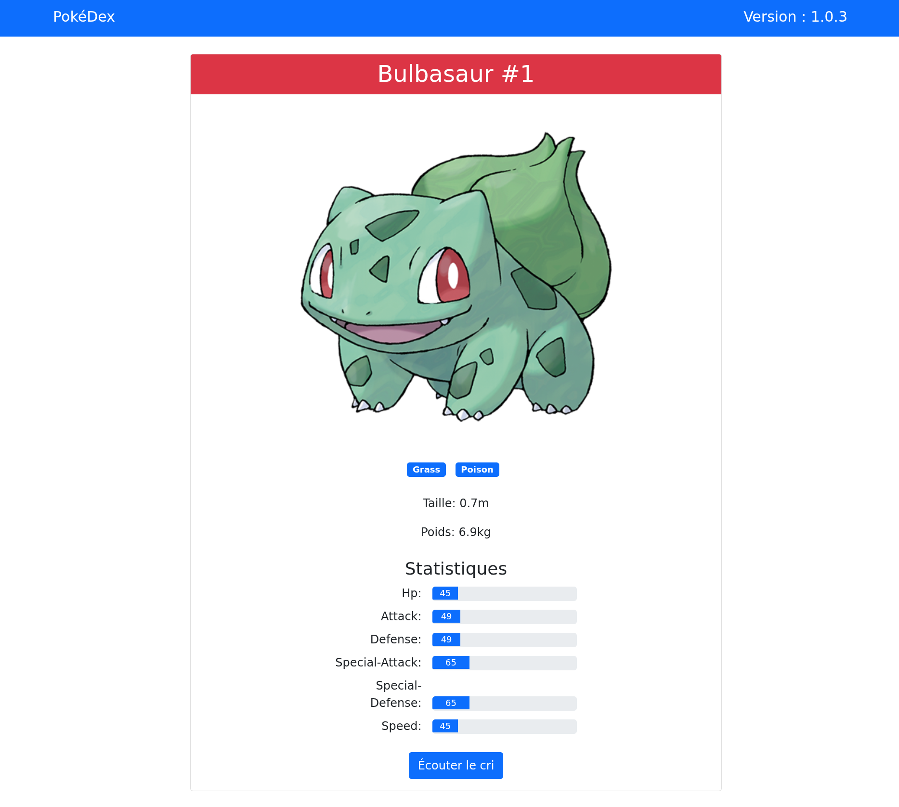
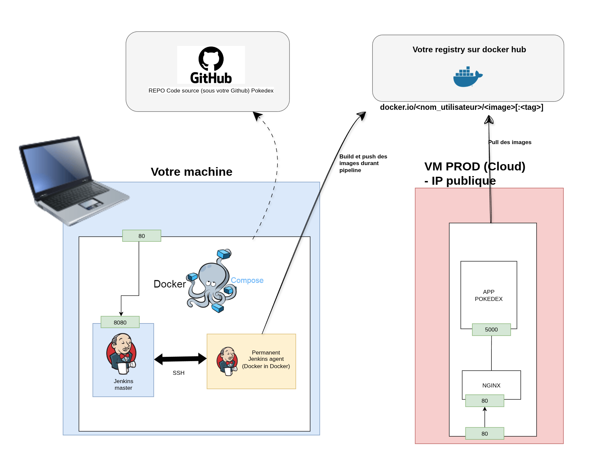

# Live Pokedex app

# Description

Une application Flask simple de pokedex qui permet de visuliser les pokemons de la première génération.
Utilise l'API PokeAPI pour récupérer les données des pokemons et les afficher dans une liste.

https://pokeapi.co/

# Instructions

```bash
# Lancer l'application en local
docker build -t pokedex .
docker run -p 5000:5000 pokedex

# Lancer les tests
docker build -t test-pokedex -f test.Dockerfile .
docker run test-pokedex
```






# Exercices

## Implémentation d'une pipeline Jenkins

- Créez une pipeline Jenkins qui a comme stages "Checkout", "Build", "Test", "Push" et "Deploy".
- Chaque commit sur "main" doit déclencher la pipeline.
- Le numéro de version doit être incrémenté automatiquement.
- Utilisez docker ou docker-compose pour déployer l'application.

**Remarques:**

Utilisez votre container registry sur DockerHub (compte gratuit), vous pouvez avoir l'image publique. (1 seule image privée par compte gratuit)
Déployez sur un serveur distant (VM Cloud fournie).
Pour pouvoir incrémenter la version automatiquement, vous aurez besoin de basculer le repo sur votre compte GitHub.




## Amélioration du déploiement

-> Utilisez un orchestrateur de conteneurs comme docker swarm pour faciliter le déploiement. (Mettez vous à plusieurs pour créer un cluster entre vos VMs)


